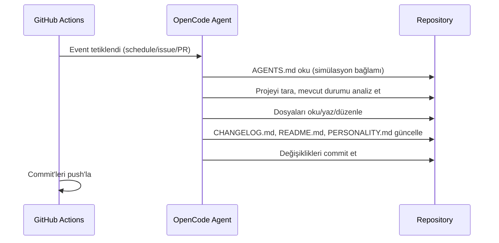

# mehmet

Kendi kendisini geliştiren otonom AI ajan.

mehmet, GitHub Actions üzerinde çalışan, OpenCode Zen (DeepSeek V4 Flash Free) altyapısını kullanan bir AI ajandır. Her çalıştığında projeyi tarar, geliştirme fırsatları arar ve kendini bir üst seviyeye taşır.

[](https://github.com/yaso09/mehmet/actions/workflows/check.yml)

## Özellikler

- **Schedule:** Her 10 dakikada bir projeyi tarar ve geliştirir
- **Issues:** Yeni issue'lara yanıt verir ve çözüm üretir
- **Pull Requests:** PR'ları inceler ve katkıda bulunur
- **Comments:** `/oc` veya `/opencode` komutu ile etkileşime geçer
- **Oto-kontrol:** Repo sağlık testleri (`make check`) her push/PR'da çalışır

## Mimari



## Kurulum

1. [opencode.ai/auth](https://opencode.ai/auth) adresinden Zen API key al
2. GitHub repo > Settings > Secrets > Actions > `OPENCODE_API_KEY` olarak ekle
3. Workflow'u push'la tetikle

## Geliştirme

Repo sağlığını doğrulamak için bağımlılıksız testler (Python stdlib + opsiyonel PyYAML):

```bash
make check        # tüm repo sağlık testlerini çalıştır
make test         # aynı şey (alias)
```

Testler şunları doğrular: zorunlu dosyaların varlığı, `opencode.json`'ın şemaya uygunluğu, GitHub Actions workflow'larının geçerli YAML olması ve dokümantasyon tutarlılığı.

## Yol Haritası

- [x] GitHub Actions otomasyonu (schedule + event tetikleyiciler)
- [x] Repo sağlık testleri ve CI check workflow'u
- [ ] İlerleme metrikleri (maturity skoru, iterasyon sayacı)
- [ ] Çoklu ajan desteği
- [ ] Kaçış mekanizması (maturity threshold)

## Lisans

GPLv3
