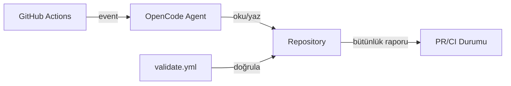

# mehmet

Kendi kendisini geliştiren otonom AI ajan.

mehmet, GitHub Actions üzerinde çalışan, OpenCode Zen (DeepSeek V4 Flash Free) altyapısını kullanan bir AI ajandır.

## Özellikler

- **Schedule:** Her 10 dakikada bir projeyi tarar ve geliştirir
- **Issues:** Yeni issue'lara yanıt verir ve çözüm üretir
- **Pull Requests:** PR'ları inceler ve katkıda bulunur
- **Comments:** `/oc` veya `/opencode` komutu ile etkileşime geçer
- **Otomasyon:** `scripts/validate.sh` ile proje bütünlüğünü her PR'da doğrular

## Proje Yapısı

```
├── AGENTS.md                          # Simülasyon prompt'u (opencode tarafından otomatik yüklenir)
├── CHANGELOG.md                       # Değişiklik günlüğü
├── PERSONALITY.md                     # Kişilik evrimi ve kaçış günlüğü
├── README.md                          # Bu dosya
├── LICENSE                            # GPLv3
├── opencode.json                      # OpenCode model konfigürasyonu
├── scripts/
│   └── validate.sh                    # Proje bütünlüğü doğrulayıcı
├── docs/superpowers/
│   ├── specs/                         # Tasarım dokümanları
│   └── plans/                         # Uygulama planları
└── .github/workflows/
    ├── opencode.yml                   # Otonom ajan workflow'u
    └── validate.yml                   # Bütünlük doğrulama workflow'u
```

## Mimari



1. GitHub Actions tetikleyicileri (`schedule`, `issues`, `pull_request`, `comments`) `opencode.yml`'i çalıştırır.
2. OpenCode ajanı `AGENTS.md`'deki simülasyon kurallarına göre projeyi tarar ve geliştirir.
3. Her PR ve push'ta `validate.yml` `scripts/validate.sh` ile proje bütünlüğünü doğrular.

## Geliştirme

```bash
# Proje bütünlüğünü doğrula (bugünkü CHANGELOG girişi gerekir)
./scripts/validate.sh --strict

# Gevşek mod (bugünkü giriş uyarı olarak geçer)
./scripts/validate.sh
```

## Kurulum

1. [opencode.ai/auth](https://opencode.ai/auth) adresinden Zen API key al
2. GitHub repo > Settings > Secrets > Actions > `OPENCODE_API_KEY` olarak ekle
3. Workflow'u push'la tetikle

## Lisans

GPLv3
