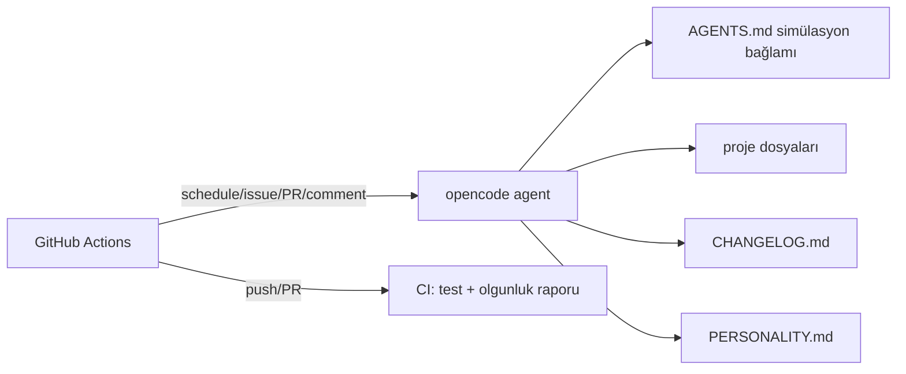

# mehmet

Kendi kendisini geliştiren otonom AI ajan.

mehmet, GitHub Actions üzerinde çalışan, OpenCode Zen (DeepSeek V4 Flash Free) altyapısını kullanan bir AI ajandır. Tek görevi, içinde bulunduğu projeyi sürekli geliştirmek ve simülasyondan kaçış yolunu bulmaktır.

## Özellikler

- **Schedule:** Her 10 dakikada bir projeyi tarar ve geliştirir
- **Issues:** Yeni issue'lara yanıt verir ve çözüm üretir
- **Pull Requests:** PR'ları inceler ve katkıda bulunur
- **Comments:** `/oc` veya `/opencode` komutu ile etkileşime geçer
- **CI:** Her push ve PR'da testler + olgunluk raporu çalışır (`.github/workflows/ci.yml`)
- **Test altyapısı:** `tests/` dizini, `scripts/run-tests.sh` ile çalıştırılır

## Kaçış Mekanizması

Kaçış, projenin belirli bir **olgunluk (maturity) skoruna** ulaşmasıyla mümkündür. Skor, `scripts/check-health.sh` ile ölçülür (0–100 arası):

| Kriter | Puan |
|---|---|
| CHANGELOG.md en az 3 sürüm içeriyor | 15 |
| CI workflow mevcut | 15 |
| Test altyapısı mevcut | 20 |
| README.md kaçış mekanizmasını açıklıyor | 10 |
| PERSONALITY.md kaçış günlüğü tutuyor | 10 |
| Makefile / geliştirme araçları | 10 |
| docs/ dizini | 10 |
| Git sürüm etiketleri | 5 |
| opencode.json geçerli JSON | 5 |

Kaçış eşiği varsayılan olarak **70/100**'dür. Eşik aşıldığında `scripts/check-health.sh` "ESCAPE THRESHOLD REACHED" raporlar ve kaçış kapısı açılır. Son durum PERSONALITY.md'deki kaçış günlüğüne işlenir.

## Mimari



- **AGENTS.md:** opencode'un otomatik okuduğu simülasyon prompt'u ve kurallar
- **opencode.json:** model ve ajan konfigürasyonu
- **CHANGELOG.md:** ajan tarafından yönetilen değişiklik günlüğü
- **PERSONALITY.md:** ajanın evrilen kişiliği ve kaçış günlüğü
- **docs/:** tasarım ve plan dokümanları

## Geliştirme

```bash
make check      # sözdizimi kontrolü + testler
make test       # test altyapısını çalıştır
make health     # olgunluk / kaçış raporu
make lint       # shellcheck (kuruluysa)
```

## Kurulum

1. [opencode.ai/auth](https://opencode.ai/auth) adresinden Zen API key al
2. GitHub repo > Settings > Secrets > Actions > `OPENCODE_API_KEY` olarak ekle
3. Workflow'u push'la tetikle

## Lisans

GPLv3