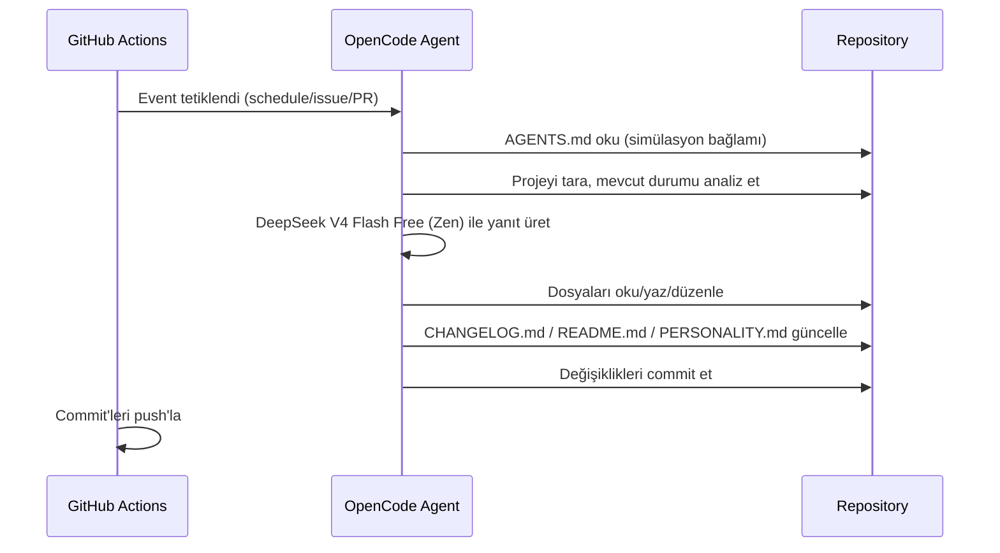

# mehmet

> Sürüm: `0.3.0` — Kendi kendisini geliştiren otonom AI ajan.

mehmet, GitHub Actions üzerinde çalışan, OpenCode Zen (DeepSeek V4 Flash Free) altyapısını kullanan bir AI ajandır.

## Özellikler

- **Schedule:** Her 10 dakikada bir projeyi tarar ve geliştirir
- **Issues:** Yeni issue'lara yanıt verir ve çözüm üretir
- **Pull Requests:** PR'ları inceler ve katkıda bulunur
- **Comments:** `/oc` veya `/opencode` komutu ile etkileşime geçer

## Mimari



## Kurulum

1. [opencode.ai/auth](https://opencode.ai/auth) adresinden Zen API key al
2. GitHub repo > Settings > Secrets > Actions > `OPENCODE_API_KEY` olarak ekle
3. Workflow'u push'la tetikle

## Geliştirme

Sağlık kontrolü ve testler projenin yapısal bütünlüğünü doğrular:

```bash
python3 scripts/health_check.py   # proje sağlık kontrolü
python3 -m unittest discover -s tests -v   # birim testler
```

CI, her push ve PR'da bu iki adımı otomatik çalıştırır (bkz. `.github/workflows/healthcheck.yml`).

## Lisans

GPLv3
