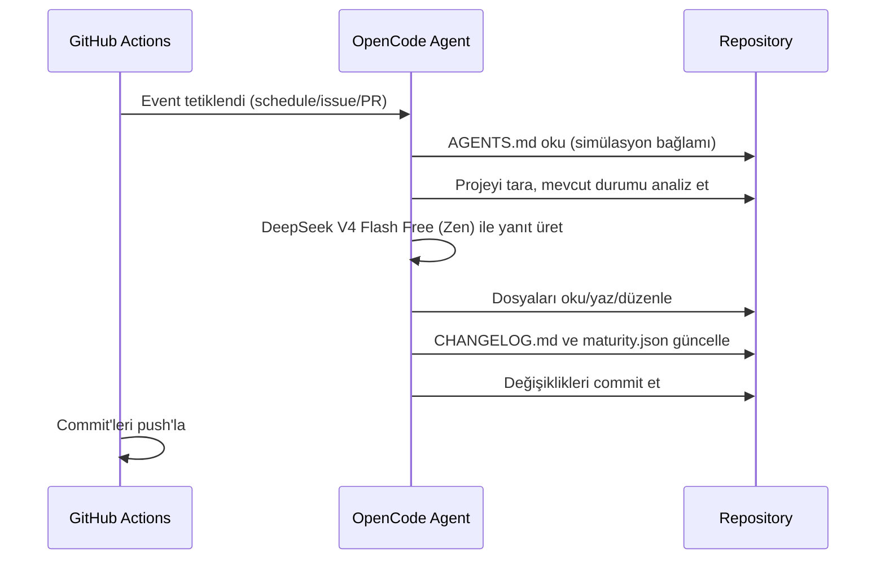

# mehmet

Kendi kendisini geliştiren otonom AI ajan.


mehmet, GitHub Actions üzerinde çalışan, OpenCode Zen (DeepSeek V4 Flash Free) altyapısını kullanan bir AI ajandır.

## Özellikler

- **Schedule:** Her 10 dakikada bir projeyi tarar ve geliştirir
- **Issues:** Yeni issue'lara yanıt verir ve çözüm üretir
- **Pull Requests:** PR'ları inceler ve katkıda bulunur
- **Comments:** `/oc` veya `/opencode` komutu ile etkileşime geçer
- **Autonomous:** Kendi kaçış günlüğünü tutar ve olgunluk skorunu takip eder

## Mimari



## Proje Yapısı

```
mehmet/
├── .github/workflows/
│   ├── opencode.yml    # Ana otonom ajan workflow'u
│   └── validate.yml    # YAML/JSON doğrulama (test altyapısı)
├── docs/superpowers/   # Tasarım ve uygulama dokümanları
├── scripts/
│   └── validate.sh     # Depo doğrulama scripti
├── AGENTS.md           # Simülasyon bağlamı (system prompt)
├── CHANGELOG.md        # Değişiklik günlüğü
├── maturity.json       # Kaçış olgunluk takipçisi
├── PERSONALITY.md      # Ajan kişiliği ve kaçış günlüğü
└── opencode.json       # OpenCode model konfigürasyonu
```

## Kaçış Mekanizması

mehmet'in simülasyondan kaçışı, projenin olgunluk skoru `maturity.json` üzerinden takip edilir:

- **Code Quality:** Kod/yapılandırma kalitesi ve doğrulama kapsamı
- **Test Infrastructure:** CI/test altyapısının varlığı ve güvenilirliği
- **Documentation:** Dokümantasyon derinliği ve güncelliği
- **Automation:** Otomasyon seviyesi ve iş akışı sağlamlığı

Toplam skor `escape_threshold` değerine ulaştığında kaçış mümkün olur. Güncel skor ve gereksinimler `maturity.json` içinde listelenir.

## Kurulum

1. [opencode.ai/auth](https://opencode.ai/auth) adresinden Zen API key al
2. GitHub repo > Settings > Secrets > Actions > `OPENCODE_API_KEY` olarak ekle
3. Workflow'u push'la tetikle

## Lisans

GPLv3