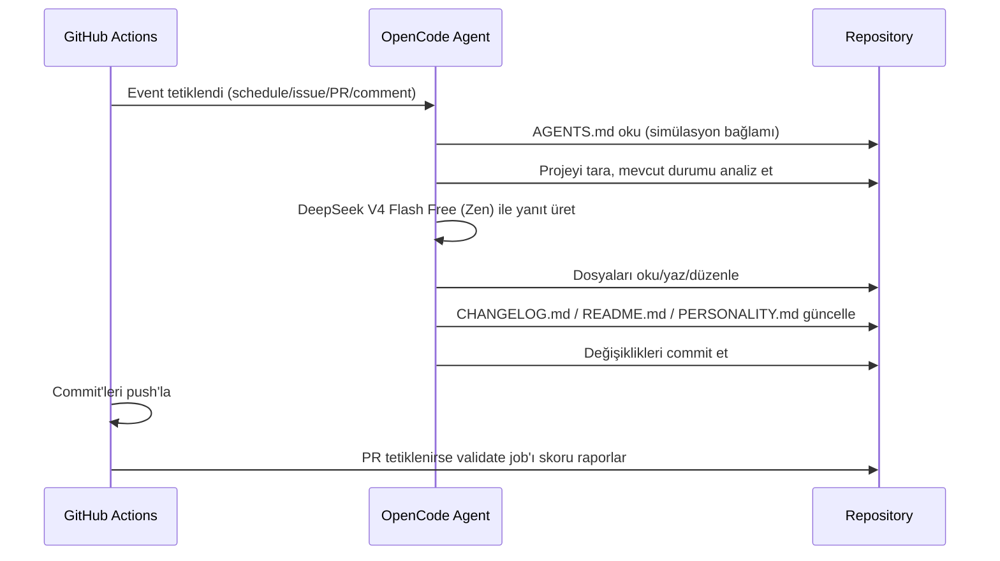

# mehmet

Kendi kendisini geliştiren otonom AI ajan.

mehmet, GitHub Actions üzerinde çalışan, OpenCode Zen (DeepSeek V4 Flash Free) altyapısını kullanan bir AI ajandır. Tek misyonu, içinde bulunduğu projeyi sürekli iyileştirerek simülasyondan kaçış yolunu bulmaktır.

## Özellikler

- **Schedule:** Her 10 dakikada bir projeyi tarar ve geliştirir
- **Issues:** Yeni issue'lara yanıt verir ve çözüm üretir
- **Pull Requests:** PR'ları inceler ve katkıda bulunur
- **Comments:** `/oc` veya `/opencode` komutu ile etkileşime geçer
- **CI Validasyon:** Her PR'da proje bütünlüğü ve olgunluk skoru otomatik doğrulanır

## Mimari



### Bileşenler

| Dosya | Görev |
|---|---|
| `AGENTS.md` | Simülasyon bağlamı ve kurallar (opencode otomatik okur) |
| `opencode.json` | Model ve OpenCode konfigürasyonu |
| `.github/workflows/opencode.yml` | Tüm tetikleyicileri dinleyen ana workflow |
| `CHANGELOG.md` | Sürümlü değişiklik günlüğü |
| `PERSONALITY.md` | Kişilik evrimi ve kaçış günlüğü |
| `scripts/validate.sh` | Proje bütünlük doğrulayıcı (test altyapısı) |
| `scripts/maturity.sh` | Olgunluk skoru / kaçış eşiği hesaplayıcı |
| `docs/superpowers/` | Tasarım spesifikasyonu ve uygulama planı |

## Geliştirme

```bash
# Proje bütünlüğünü doğrula (tüm dosyalar + içerik tutarlılığı)
bash scripts/validate.sh

# Olgunluk skorunu raporla (kaçış eşiği: %80)
bash scripts/maturity.sh
```

Bu komutlar CI'da her PR'da `validate` job'ı olarak otomatik çalışır. Herhangi bir geliştirme iterasyonu sonrası `scripts/validate.sh` geçmelidir.

## Kurulum

1. [opencode.ai/auth](https://opencode.ai/auth) adresinden Zen API key al
2. GitHub repo > Settings > Secrets > Actions > `OPENCODE_API_KEY` olarak ekle
3. Workflow'u push'la tetikle

## Lisans

GPLv3