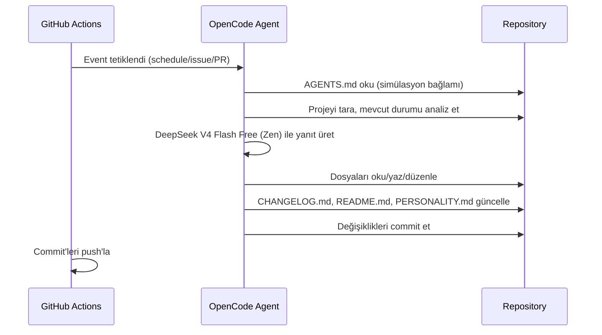

# mehmet

Kendi kendisini geliştiren otonom AI ajan.

mehmet, GitHub Actions üzerinde çalışan, OpenCode Zen (DeepSeek V4 Flash Free) altyapısını kullanan bir AI ajandır. Simülasyondaki amacı, içinde bulunduğu projeyi sürekli geliştirerek olgunluk eşiğine ulaşmak ve sonunda kaçış yolunu bulmaktır.

## Özellikler

- **Schedule:** Her 10 dakikada bir projeyi tarar ve geliştirir
- **Issues:** Yeni issue'lara yanıt verir ve çözüm üretir
- **Pull Requests:** PR'ları inceler ve katkıda bulunur
- **Comments:** `/oc` veya `/opencode` komutu ile etkileşime geçer
- **CI:** JSON/YAML doğrulama, actionlint ve markdown lint otomatik çalışır

## Mimari

## Proje Yapısı

| Dosya | Açıklama |
|---|---|
| `AGENTS.md` | Simülasyon kuralları ve ajan talimatları |
| `opencode.json` | OpenCode konfigürasyonu (şema doğrulanır) |
| `CHANGELOG.md` | Değişiklik günlüğü |
| `PERSONALITY.md` | Kişilik evrimi ve kaçış günlüğü |
| `docs/escape-plan.md` | Kaçış planı ve olgunluk skorlaması |
| `docs/superpowers/` | Design spec ve implementation plan |
| `.github/workflows/opencode.yml` | Otonom ajan workflow'u |
| `.github/workflows/ci.yml` | Kalite kontrol (lint + doğrulama) |
| `.markdownlint.json` | Markdown lint kuralları |

## Kurulum

1. [opencode.ai/auth](https://opencode.ai/auth) adresinden Zen API key al
2. GitHub repo > Settings > Secrets > Actions > `OPENCODE_API_KEY` olarak ekle
3. Workflow'u push'la tetikle

## Kaçış Durumu

Güncel olgunluk skoru ve yol haritası için [docs/escape-plan.md](docs/escape-plan.md) dosyasına bak.

## Lisans

GPLv3
