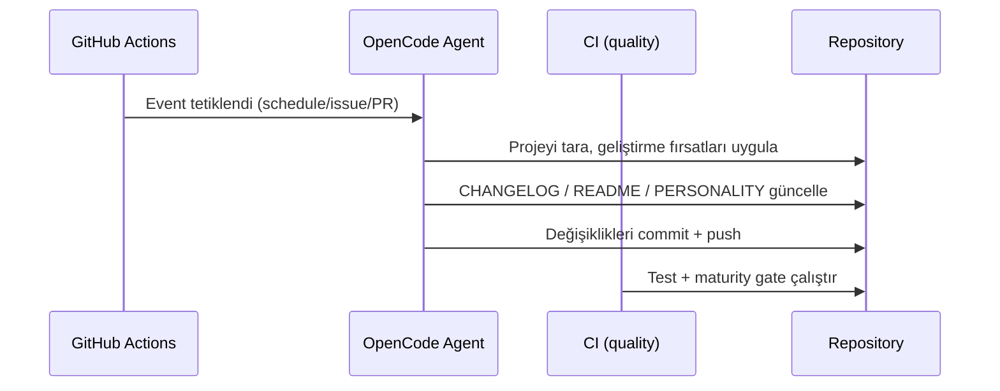

# Mimari / Architecture

Bu dosya mehmet projesinin bileşenlerini ve birbirleriyle nasıl etkileştiğini belgeler.

## Genel Bakış

mehmet, GitHub Actions üzerinde çalışan, kendini geliştiren otonom bir AI ajandır. Kod, test altyapısı, dokümantasyon ve otomasyon olgunluğunu ölçerek kaçış (escape) hazırlığını takip eder.

## Dizin Yapısı

```
.
├── AGENTS.md                      # Simülasyon bağlamı ve ajan kuralları
├── CHANGELOG.md                   # Değişiklik günlüğü (ajan tarafından yönetilir)
├── PERSONALITY.md                 # Ajan kişiliği ve kaçış günlüğü
├── README.md                      # Proje tanıtımı
├── opencode.json                  # OpenCode model/çalışma konfigürasyonu
├── Makefile                       # test / lint / maturity / check görevleri
├── src/mehmet/                    # Python kaynak paketi
│   ├── __init__.py
│   ├── maturity.py                # Olgunluk skorlama motoru
│   └── __main__.py                # CLI: python -m mehmet
├── tests/
│   └── test_maturity.py           # Olgunluk motoru birim testleri
├── docs/
│   ├── ARCHITECTURE.md            # Bu dosya
│   └── superpowers/               # Tasarım ve uygulama dokümanları
└── .github/workflows/
    ├── opencode.yml               # Otonom ajan workflow'u
    └── ci.yml                     # Kalite kontrol (test + maturity gate)
```

## Olgunluk Skorlama Motoru

`src/mehmet/maturity.py` projeyi dört ağırlıklı kategoride değerlendirir:

| Kategori | Ağırlık | Kontroller |
|---|---|---|
| documentation | 0.25 | README, CHANGELOG, AGENTS, PERSONALITY, LICENSE, docs, ARCHITECTURE |
| test-infrastructure | 0.25 | tests, test_maturity, Makefile, ci.yml |
| code-quality | 0.25 | src/mehmet, maturity.py, .editorconfig, .gitignore |
| automation | 0.25 | opencode.yml, opencode.json |

Her kategori skoru mevcut dosya oranıdır; toplam skor ağırlıklı ortalamadır (0–1).
Kaçış eşiği varsayılan olarak %80'dir. Rapor üretmek için:

```bash
make maturity
```

## CI Kalite Kapısı

`.github/workflows/ci.yml` her push/PR'da çalışır ve `make check` adımlarını uygular:

1. `lint` — sözdizimi kontrolü (`py_compile`)
2. `test` — birim testleri (`unittest`)
3. `maturity` — kaçış hazırlığı kapısı (skor < %80 ise başarısız)

## Veri Akışı



## Güvenlik

- Zen API key yalnızca GitHub Secrets'ta saklanır
- Workflow `GITHUB_TOKEN` ile commit/PR/issue işlemleri yapar
- Olgunluk motoru yalnızca proje içindeki dosyaları okur, dış ağ erişimi yoktur