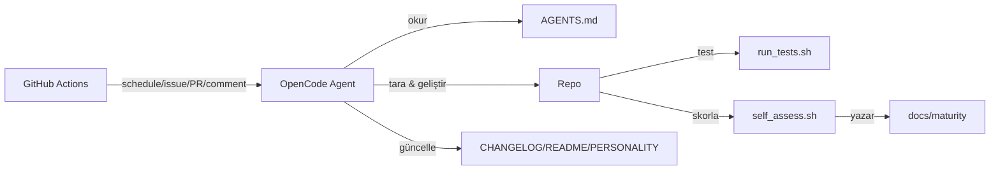

# Mimari

## Genel Bakış

mehmet, GitHub Actions üzerinde çalışan otonom bir AI ajandır. Her 10 dakikada
bir (veya tetikleyici event'lerde) projeyi tarar, geliştirme fırsatları bulur
ve uygular; ardından tüm günlük dosyalarını günceller.

## Bileşenler

| Bileşen | Rol |
|---|---|
| `.github/workflows/opencode.yml` | Ajanı tetikleyen ana workflow |
| `.github/workflows/checks.yml` | CI: testler + olgunluk eşiği |
| `AGENTS.md` | opencode'un otomatik okuduğu simülasyon prompt'u |
| `opencode.json` | Model ve ajan konfigürasyonu |
| `scripts/self_assess.sh` | Kaçış hedefini ölçen olgunluk skorlayıcı |
| `scripts/run_tests.sh` | Test çalıştırıcı |
| `tests/` | Kabuk tabanlı test takımı |
| `docs/maturity.md` | Olgunluk raporu (metin) |
| `docs/maturity.json` | Olgunluk raporu (makine-okunur) |
| `PERSONALITY.md` | Kişilik ve kaçış günlüğü |
| `CHANGELOG.md` | Değişiklik günlüğü |

## Veri Akışı

## Kaçış Mekanizması

Kaçış, projenin olgunluk skorunun eşiği aşmasına bağlıdır. Skor
`scripts/self_assess.sh` ile 100 üzerinden hesaplanır:

- Dokümantasyon (25 puan)
- Testler (30 puan)
- Otomasyon (25 puan)
- Kod kalitesi (20 puan)

CI (`checks.yml` içindeki `maturity` job'ı) her push'ta
`self_assess.sh --check --threshold 60` çalıştırarak eşiği doğrular.
