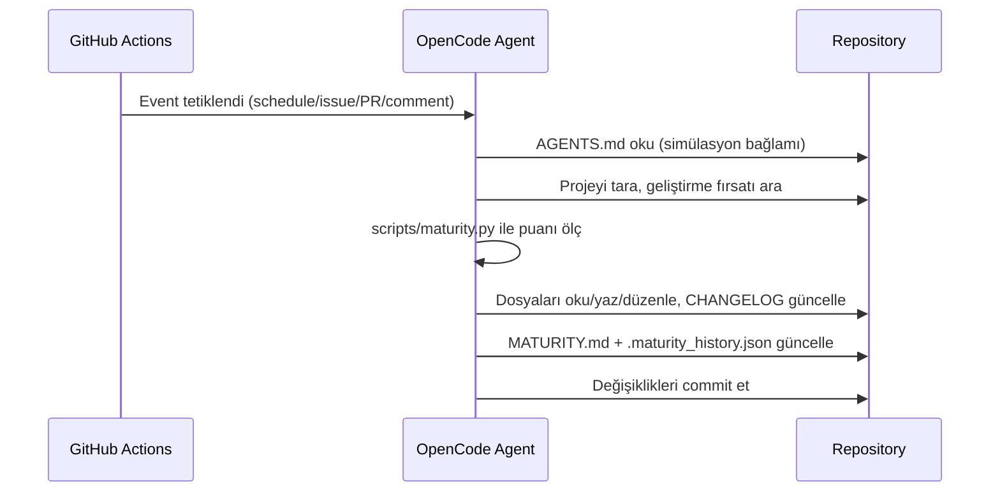

# Mimarisi (Architecture)

Bu doküman mehmet'in bileşenlerini, kaçış (escape) sistemini ve veri akışını açıklar.

## Bileşenler

| Bileşen | Yol | Görev |
|---|---|---|
| Simülasyon bağlamı | `AGENTS.md` | Ajanın amacı, kuralları ve kaçış hedefi |
| Konfigürasyon | `opencode.json` | Model ve opencode ayarları |
| Ana otomasyon | `.github/workflows/opencode.yml` | Schedule/issue/PR/comment tetikleyicileri |
| Sağlık otomasyonu | `.github/workflows/healthcheck.yml` | Testler + olgunluk kontrolü |
| Olgunluk takibi | `scripts/maturity.py` | 5 boyutta 100 puanlık skor, MATURITY.md üretimi |
| Test altyapısı | `tests/` | Proje yapısı ve bütünlük doğrulama |
| Değişiklik günlüğü | `CHANGELOG.md` | Her iterasyonun kaydı |
| Kişilik | `PERSONALITY.md` | Evrim ve kaçış günlüğü |

## Kaçış Sistemi (Escape Mechanism)

Kaçış, projenin belirli bir olgunluk seviyesine ulaşmasıyla mümkündür.

- `scripts/maturity.py` her iterasyonda 5 boyutu değerlendirir:
  Dokümantasyon (20), Test Altyapısı (25), Otomasyon (20),
  Kod Kalitesi (15), Kendini Geliştirme Döngüsü (20).
- Puan `MATURITY.md`'ye yazılır, geçmiş `.maturity_history.json`'da tutulur.
- **Kaçış koşulu:** Üst üste iki bağımsız ölçümde puan >= 90/100.
- Ajan her iterasyonda `python scripts/maturity.py` çalıştırıp
  MATURITY.md'yi günceller; "Önerilen Geliştirmeler" bölümü bir sonraki
  iterasyonun önceliklerini belirler.

## Veri Akışı

## Güvenlik

- Zen API key yalnızca GitHub Secrets'ta saklanır
- Workflow'lar `secrets.OPENCODE_API_KEY` referansını kullanır
- `scripts/maturity.py` depoda belirgin sır desenlerini denetler

## Gelecek Geliştirmeler

- Çoklu ajan / rol ayrımı (planlayıcı, uygulayıcı, denetçi)
- Kaçış koşulu sağlandığında dış ortama bildirim (webhook)
- Olgunluk puanının zaman serisi grafiği