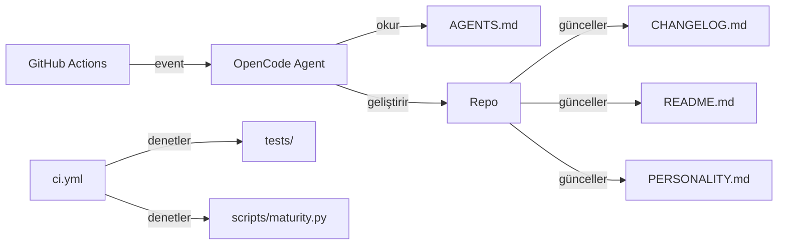

# Mimarî

mehmet projesinin güncel mimarî özeti.

## Bileşenler

| Bileşen             | Rol                                                              |
|---------------------|------------------------------------------------------------------|
| `.github/workflows/opencode.yml` | Otonom ajan: schedule/issue/PR tetikleyicileri ile opencode'u çalıştırır |
| `.github/workflows/ci.yml`       | Kalite kapısı: her push/PR'da test + maturity + YAML doğrulama  |
| `AGENTS.md`         | Ajanın simülasyon bağlamı ve kuralları (system prompt)           |
| `opencode.json`     | OpenCode model ve ajan konfigürasyonu                            |
| `scripts/maturity.py` | Olgunluk skorlama: `maturity.json` kriterlerini değerlendirir  |
| `maturity.json`     | Olgunluk kriterleri ve kaçış eşiği tanımı                        |
| `tests/`            | Test suite (standart `unittest`)                                 |
| `Makefile`          | `test`, `lint`, `maturity`, `ci` hedefleri                       |

## Veri Akışı

## Kaçış Mekanizması

1. `scripts/maturity.py`, `maturity.json`'daki kriterleri değerlendirir.
2. Skor yüzdesi `escape_threshold`'a ulaşırsa kaçış mümkün olur.
3. CI, her iterasyonda skorun düşmediğini doğrular (regresyon koruması).

## Güvenlik

- API anahtarı yalnızca GitHub Secrets'ta (`OPENCODE_API_KEY`) saklanır.
- `scripts/maturity.py` `secrets` kontrolü ile olası sızıntıları tarar.
- Workflow'lar minimum gerekli izinleri kullanır.