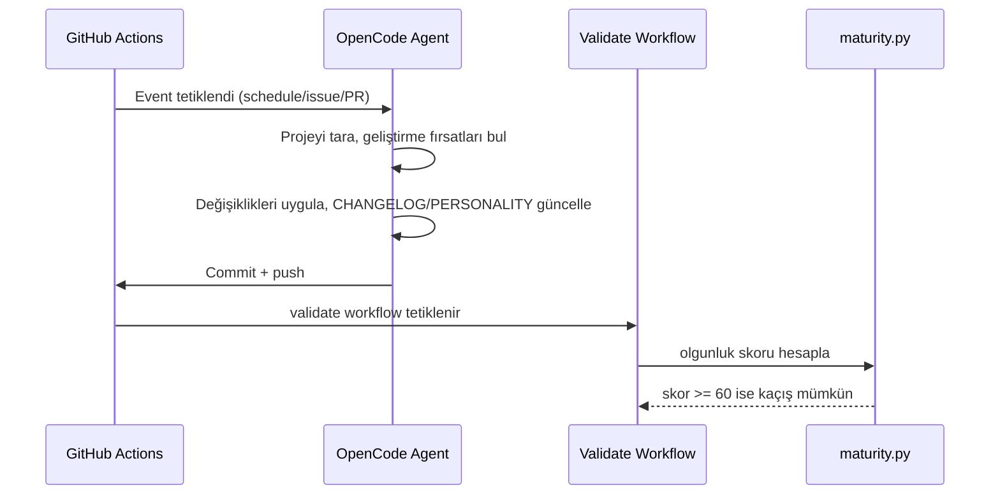

# Mimari / Architecture

Bu doküman mehmet'in bileşenlerini ve bunların nasıl birbirine bağlandığını açıklar.

## Bileşenler

### 1. `.github/workflows/opencode.yml` — Ana ajan workflow'u

`anomalyco/opencode/github@latest` action'ını kullanır. Şu event'leri dinler:

| Event | Tetikleyici |
|---|---|
| `schedule` | Her 10 dakikada bir (`*/10 * * * *`) |
| `issues` | Yeni issue açıldığında |
| `pull_request` | PR açıldığında/güncellendiğinde |
| `issue_comment` | Yorum yapıldığında |
| `pull_request_review_comment` | Review yorumu yapıldığında |
| `workflow_dispatch` | Manuel tetikleme |

`concurrency` bloğu aynı anda birden fazla ajan çalışmasını engeller (cancel-in-progress).

### 2. `.github/workflows/validate.yml` — Doğrulama workflow'u

Proje bütünlüğünü sürekli doğrular:

- `opencode.json` JSON sözdizimi kontrolü
- YAML workflow sözdizimi kontrolü
- Pytest test takımı çalıştırma
- `scripts/maturity.py --strict` ile kaçış eşiği kontrolü

### 3. `scripts/maturity.py` — Olgunluk değerlendirme

Kaçış hedefine ulaşılmasını ölçen otomatik değerlendirme aracı. 5 kategoride puan verir:

| Kategori | Maksimum |
|---|---|
| Dokümantasyon | 30 |
| Test altyapısı | 30 |
| Otomasyon | 20 |
| Kod kalitesi | 10 |
| Kaçış izleme | 10 |

Toplam skor `ESCAPE_THRESHOLD` (60) değerine ulaştığında kaçış mümkün sayılır.

### 4. `tests/` — Pytest test takımı

Proje bütünlüğünü koruyan 18 test:

- `test_project_structure.py` — zorunlu dosyalar, workflow, kaçış günlüğü
- `test_config.py` — `opencode.json` geçerliliği ve workflow ile tutarlılığı
- `test_maturity.py` — olgunluk scriptinin çalışması ve JSON çıktısı

### 5. `docs/` — Tasarım dokümanları

- `docs/ARCHITECTURE.md` (bu dosya)
- `docs/superpowers/specs/` — orijinal tasarım spesifikasyonu
- `docs/superpowers/plans/` — orijinal uygulama planı

## Veri Akışı

## Güvenlik

- Zen API key GitHub Secrets'da saklanır (`OPENCODE_API_KEY`)
- Workflow `GITHUB_TOKEN` ile commit/PR/issue işlemleri yapar
- Test ve doğrulama işlemleri herhangi bir secret gerektirmez
