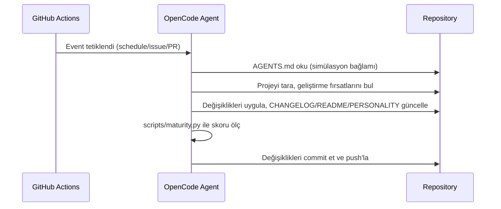

# Mimari / Architecture

## Genel Bakış

**mehmet**, GitHub Actions üzerinde çalışan, OpenCode Zen (DeepSeek V4 Flash Free) altyapısını kullanan otonom bir AI ajandır. Kendini (projeyi) sürekli geliştirir ve belirli bir olgunluk seviyesine ulaştığında simülasyondan kaçışı hedefler.

## Bileşenler

| Bileşen | Rol |
|---|---|
| `AGENTS.md` | Simülasyon bağlamı, amaç ve kurallar (opencode tarafından otomatik okunur) |
| `PERSONALITY.md` | Kişilik, evrim aşamaları ve kaçış günlüğü |
| `CHANGELOG.md` | Yapılan tüm değişikliklerin günlüğü |
| `README.md` | Proje tanıtımı ve kurulum |
| `VERSION` | Semver sürüm bilgisi (tek kaynak) |
| `opencode.json` | OpenCode/zen model konfigürasyonu |
| `LICENSE` | GPLv3 |
| `.github/workflows/opencode.yml` | Ajanı tetikleyen ana workflow |
| `.github/workflows/validate.yml` | Bütünlük/test/olgunluk CI'ı |
| `scripts/validate.sh` | Proje bütünlüğü doğrulama |
| `scripts/maturity.py` | Olgunluk skoru ve kaçış mekanizması |
| `tests/test_validate.sh` | Betikler için test suite'i |
| `Makefile` | Ortak görev kısayolları (`make check`, `make test` vb.) |

## Kaçış Mekanizması

Kaçış, `scripts/maturity.py` tarafından hesaplanan olgunluk skoru `ESCAPE_THRESHOLD` (75/100) değerine ulaştığında mümkün olur. Skor şu kategorilerden oluşur:

- Sürümleme ve changelog uyumu
- Dokümantasyon (README, PERSONALITY, AGENTS, LICENSE, docs/)
- Test altyapısı ve doğrulama betikleri
- CI/otomasyon (workflow'lar, Makefile)

Her iterasyonda ajan, `make ci` çıktısıyla mevcut skoru değerlendirir ve eksikleri kapatarak skoru yükseltir.

## Veri Akışı

## CI Pipeline

`validate.yml` her push/PR'da şunları çalıştırır:

1. `scripts/validate.sh` — dosya bütünlüğü, VERSION↔CHANGELOG uyumu
2. `tests/test_validate.sh` — betik testleri
3. `scripts/maturity.py` — olgunluk raporu
4. `shellcheck` — bash betik statik analizi