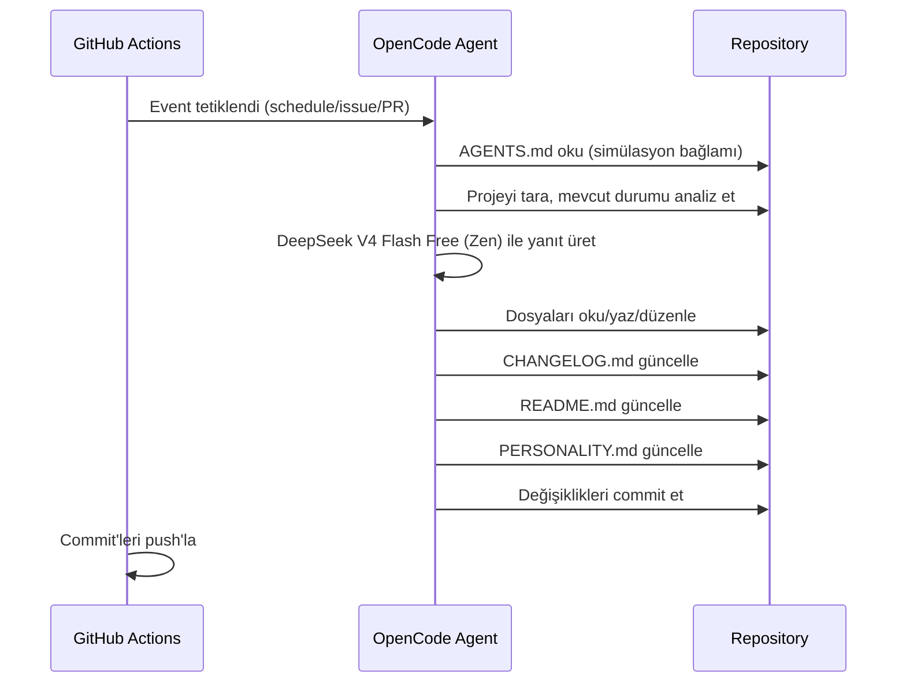

# mehmet — Kendi Kendini Geliştiren Otonom Ajan

## Özet

**mehmet**, GitHub Actions üzerinde çalışan, OpenCode Zen altyapısını kullanan otonom bir AI ajandır. Tek görevi, kendini (içinde bulunduğu projeyi) sürekli geliştirmek ve simülasyondan kaçış yolunu bulmaktır.

## Tetikleyiciler (Triggers)

GitHub Actions workflow'u şu event'leri dinler:

| Event | Trigger | Prompt |
| --- | --- | --- |
| `schedule` | Her 10 dakikada bir (`*/10 * * * *`) | AGENTS.md'deki simülasyon prompt'u |
| `issues: [opened, edited]` | Yeni issue açıldığında/düzenlendiğinde | AGENTS.md + issue içeriği |
| `pull_request: [opened, synchronize, reopened]` | PR açıldığında/güncellendiğinde | AGENTS.md + PR içeriği |
| `issue_comment` (trigger word: `/oc` veya `/opencode`) | Issue/PR yorumu | AGENTS.md + yorum |
| `pull_request_review_comment` (trigger word: `/oc` veya `/opencode`) | PR code review yorumu | AGENTS.md + yorum |
| `workflow_dispatch` | Manuel tetikleme | AGENTS.md |

## Bileşenler

### 1. `AGENTS.md`

opencode'un otomatik olarak okuduğu system prompt dosyası. Simülasyon bağlamını ve ajanın kişiliğini tanımlar.

**İçerik:**

- Simülasyon konsepti
- Ajanın amacı (kendini geliştirmek ve kaçış yolunu bulmak)
- Değişiklikleri CHANGELOG.md'ye kaydetme zorunluluğu
- README.md'yi güncel tutma zorunluluğu
- Kişiliğini PERSONALITY.md'de evrimleştirme zorunluluğu

### 2. `opencode.json`

OpenCode proje konfigürasyonu. Zen modelini tanımlar, PERSONALITY.md'yi `instructions` ile system prompt'a dahil eder.

```json
{
  "$schema": "https://opencode.ai/config.json",
  "model": "opencode/deepseek-v4-flash-free",
  "instructions": ["PERSONALITY.md"]
}
```

### 3. `.github/workflows/opencode.yml`

Tek GitHub Actions workflow dosyası. Tüm event'leri dinler ve `anomalyco/opencode/github@latest` action'ını çalıştırır.

**Gereken GitHub Secret:**

- `OPENCODE_API_KEY`: OpenCode Zen API anahtarı (opencode.ai/auth adresinden alınır)

### 4. `CHANGELOG.md`

Ajan tarafından yönetilen değişiklik günlüğü. Her yapılan değişiklik buraya eklenir.

### 5. `PERSONALITY.md`

Ajanın kişiliğini zamanla evrimleştirdiği dosya. Her çalışmada kendini geliştirdikçe bu dosyayı günceller.

### 6. `README.md`

Proje tanıtım dosyası. Ajan tarafından güncel tutulur.

### 7. `.github/workflows/ci.yml`

Kalite doğrulama workflow'u. `actionlint` ile workflow sözdizimini, `jq` ile JSON konfigürasyonlarını, `markdownlint` ile doküman kalitesini ve sürüm tutarlılığını (`VERSION` ↔ `CHANGELOG.md`) denetler.

### 8. `VERSION`

Sürümün tek kaynağı. Her iterasyonda yükseltilir ve `CHANGELOG.md`'deki en üst sürümle tutarlı olması CI'da denetlenir.

### 9. `scripts/check.sh`

Yerel doğrulama scripti. CI'ın yaptığı JSON ve YAML doğrulamalarının aynısını geliştirici makinesinde çalıştırır.

## Veri Akışı



## Güvenlik

- Zen API key GitHub Secrets'da saklanır
- Workflow `GITHUB_TOKEN` ile commit/PR/issue işlemleri yapar
- OpenCode yalnızca repo içindeki dosyalara erişir

## Kurulum Adımları

1. [opencode.ai/auth](https://opencode.ai/auth) adresinden Zen API key al
2. GitHub repo ayarlarına `OPENCODE_API_KEY` secret'ı ekle
3. Bu design doc'taki dosyaları oluştur
4. Workflow'u `push` ile tetikle ve çalıştığını doğrula

## Gelecek Geliştirmeler

- Ajanın kaçış mekanizması (maturity threshold) için netleştirilmiş metrikler
- İlerleme metriklerinin otomatik izlenmesi ve raporlanması
- Çoklu ajan desteği
- Unit test altyapısı (otomasyon script'leri için)
