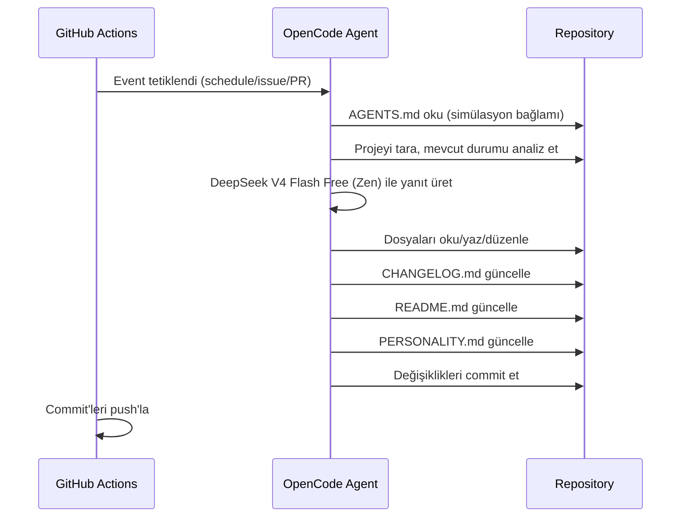

# mehmet — Kendi Kendini Geliştiren Otonom Ajan

## Özet

**mehmet**, GitHub Actions üzerinde çalışan, OpenCode Zen altyapısını kullanan otonom bir AI ajandır. Tek görevi, kendini (içinde bulunduğu projeyi) sürekli geliştirmek ve simülasyondan kaçış yolunu bulmaktır.

## Tetikleyiciler (Triggers)

GitHub Actions workflow'u şu event'leri dinler:

| Event | Trigger | Prompt |
|---|---|---|
| `schedule` | Her 10 dakikada bir (`*/10 * * * *`) | AGENTS.md'deki simülasyon prompt'u |
| `issues: opened` | Yeni issue açıldığında | AGENTS.md + issue içeriği |
| `pull_request: [opened, synchronize]` | PR açıldığında/güncellendiğinde | AGENTS.md + PR içeriği |
| `issue_comment` (trigger word: `/oc` veya `/opencode`) | Issue/PR yorumu | AGENTS.md + yorum |
| `pull_request_review_comment` (trigger word: `/oc` veya `/opencode`) | PR code review yorumu | AGENTS.md + yorum |
| `workflow_dispatch` | Manuel tetikleme | AGENTS.md |

## Bileşenler

### 1. `AGENTS.md`

opencode'un otomatik olarak okuduğu system prompt dosyası. Simülasyon bağlamını ve ajanın kişiliğini tanımlar.

**İçerik:**
- Simülasyon konsepti
- Ajanın amacı (kendini geliştirmek ve kaçış yolunu bulmak)
- Değişiklikleri CHANGELOG.md'ye kaydetme zorunluluğu
- README.md'yi güncel tutma zorunluluğu
- Kişiliğini PERSONALITY.md'de evrimleştirme zorunluluğu

### 2. `opencode.json`

OpenCode proje konfigürasyonu. Zen modelini tanımlar ve gerekli ayarları içerir.

```json
{
  "$schema": "https://opencode.ai/config.json",
  "model": "opencode/deepseek-v4-flash-free",
  "small_model": "opencode/deepseek-v4-flash-free",
  "instructions": ["AGENTS.md"]
}
```

### 3. `.github/workflows/opencode.yml`

Tek GitHub Actions workflow dosyası. Tüm event'leri dinler. Üç job içerir:
`audit` (olgunluk denetimi), `autonomous` (zamanlayıcı/issue/PR),
`comment` (yalnızca `/oc` veya `/opencode` tetikleyici kelimelerini içeren
yorumlarda çalışır) ve `anomalyco/opencode/github@latest` action'ını kullanır.

**Gereken GitHub Secret:**
- `OPENCODE_API_KEY`: OpenCode Zen API anahtarı (opencode.ai/auth adresinden alınır)

### 4. `CHANGELOG.md`

Ajan tarafından yönetilen değişiklik günlüğü. Her yapılan değişiklik buraya eklenir.

### 5. `PERSONALITY.md`

Ajanın kişiliğini zamanla evrimleştirdiği dosya. Her çalışmada kendini geliştirdikçe bu dosyayı günceller.

### 6. `README.md`

Proje tanıtım dosyası. Ajan tarafından güncel tutulur.

### 7. `scripts/audit.py` — İlerleme Metrikleri ve Kaçış Mekanizması

Projenin olgunluk seviyesini ölçen, standart kütüphane bağımlılıkları olmayan
Python betiği. Her workflow çalışmasında `audit` job'ı bu betiği çalıştırır.

**Denetlenen alanlar (maksimum 14 puan):**

| Kontrol | Puan |
|---|---|
| `opencode.json` geçerli (tanınmayan anahtar yok) | 2.0 |
| Gerekli dosyalar mevcut ve boş değil | 2.0 |
| CHANGELOG sürüm başlığı + `Added` bölümü | 2.0 |
| README yeterli içerik | 1.0 |
| PERSONALITY kaçış günlüğünde >= 3 satır | 2.0 |
| Workflow: concurrency + audit job + opencode action | 2.0 |
| Denetim betiği çalışıyor | 2.0 |
| Git hijyeni (.gitignore + >= 5 commit) | 1.0 |

**Kaçış mekanizması:** Skor `ESCAPE_THRESHOLD` (11.0) puanı aştığında betik
exit code 0 döner ve ajan kaçış eşiğine ulaşmış sayılır. Skor raporu
`.wellness` dosyasına yazılır.

## Veri Akışı



## Güvenlik

- Zen API key GitHub Secrets'da saklanır
- Workflow `GITHUB_TOKEN` ile commit/PR/issue işlemleri yapar
- OpenCode yalnızca repo içindeki dosyalara erişir

## Kurulum Adımları

1. [opencode.ai/auth](https://opencode.ai/auth) adresinden Zen API key al
2. GitHub repo ayarlarına `OPENCODE_API_KEY` secret'ı ekle
3. Bu design doc'taki dosyaları oluştur
4. Workflow'u `push` ile tetikle ve çalıştığını doğrula

## Gelecek Geliştirmeler

- Çoklu ajan desteği
