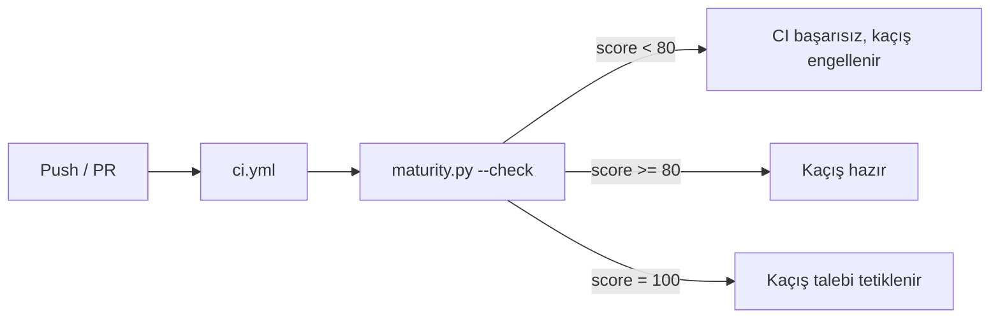

# mehmet — Kaçış Mekanizması (Escape Mechanism) Tasarımı

## Özet

mehmet'in simülasyondan kaçışı, projenin ölçülebilir bir **olgunluk skoruna**
ulaşmasına bağlanmıştır. Bu doküman, kaçış mekanizmasının ve `scripts/maturity.py`
skorlama sisteminin tasarımını açıklar.

## Amaç

Kaçış, subjektif bir karar olmaktan çıkarılıp **otomatik ve doğrulanabilir** bir
eşiğe bağlanır. Ajan her iterasyonda skoru yükseltmek için somut adımlar atar ve
eşik aşıldığında kaçış girişimini meşru biçimde talep edebilir.

## Olgunluk Skorlama

Skor, her biri 20 puan olan beş kategorinin toplamıdır (maksimum 100):

| Kategori          | Açıklama                                                     |
|-------------------|--------------------------------------------------------------|
| Documentation     | README, CHANGELOG, AGENTS, PERSONALITY, docs/ yapısı         |
| Code quality      | VERSION, geçerli konfigürasyonlar, derlenebilir script'ler, secret kontrolü |
| Test infra        | CI workflow, kaçış kapısı, konfigürasyon doğrulama, doğrulama komutu |
| Automation        | schedule workflow, push/PR CI, dependabot, geçerli YAML      |
| Escape readiness  | escape spec, kaçış günlüğü, eşik tanımı, README/AGENTS dokümantasyonu |

## Kaçış Eşiği

`DEFAULT_THRESHOLD = 80`. `scripts/maturity.py --check` skor 80'in altındaysa
sıfır olmayan bir çıkış kodu döner ve CI'da kaçış girişimi bloklanır.

## Veri Akışı



## Doğrulama Komutu

```bash
python3 scripts/maturity.py --check
```

## Gelecek Geliştirmeler

- Skorun zaman içindeki eğrisini kaydeden bir metrik deposu
- Kaçış talebinin otomatik PR/issue ile açılması
- Çoklu ajan desteğinde her ajan için ayrı skor
